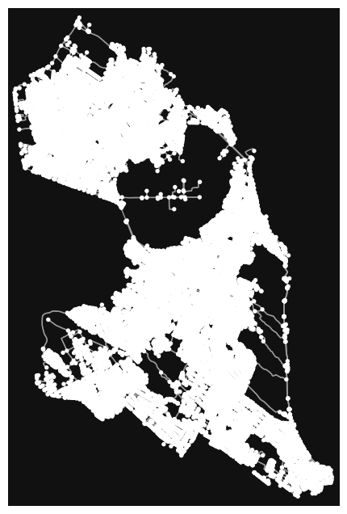

## 💻 Sobre

O projeto final da unidade 3 consiste em aplicar o conhecimento visto durante o semestre com novas ferramentas e resolvendo problemas reais, como a análise de rede de ruas de Natal, Brasil, com OSMnx e NetworkX.

### 1. Escolha das Cidades ou Áreas de Estudo:

    Foi escolhida a cidade de Natal para o projeto, pois apresenta desafios específicos em termos de mobilidade urbana.

### 2. Extração da Rede de Ruas:
2.1 Uso do OSMnx:

    Instalação da biblioteca OSMnx no ambiente Google Colab (pip install osmnx).
    Utilização da função osmnx.graph_from_place para extrair a rede de ruas da área escolhida.
    Consulta à documentação do OSMnx para mais detalhes sobre as opções disponíveis.

2.2 Limpeza de Dados:

    Análise os dados obtidos e remoção das informações irrelevantes.
    Tratamento dos possíveis discrepâncias e inconsistências nos dados.

### 3. Análise Básica da Rede:
3.1 Número de Nós e Arestas:

    Utilização das funções de NetworkX para calcular o número total de nós e arestas na rede.

3.2 Densidade da Rede:

    Cálculo da densidade da rede utilizando a fórmula densidade = 2 * número de arestas / (número de nós * (número de nós - 1)).

3.3 Comprimento Total das Ruas:

    Utilização das informações fornecidas pelo OSMnx ou calcule o comprimento total das ruas utilizando as coordenadas dos nós.

3.4 Medidas de Centralidade:

    Utilização das funções de centralidade do NetworkX para calcular medidas como betweenness centrality e degree centrality.

## 

Para extrair a rede de ruas de uma área específica foi usado o OSMnx e a biblioteca Matplotlib para visualização. O resultado foi o seguinte:

## 🦸 Autor

 
 <b>Bruno Valniery</b>

